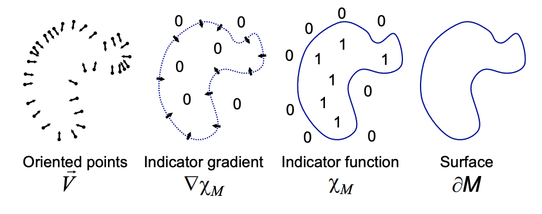
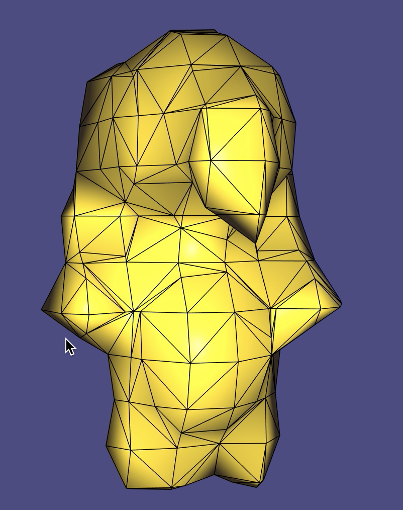
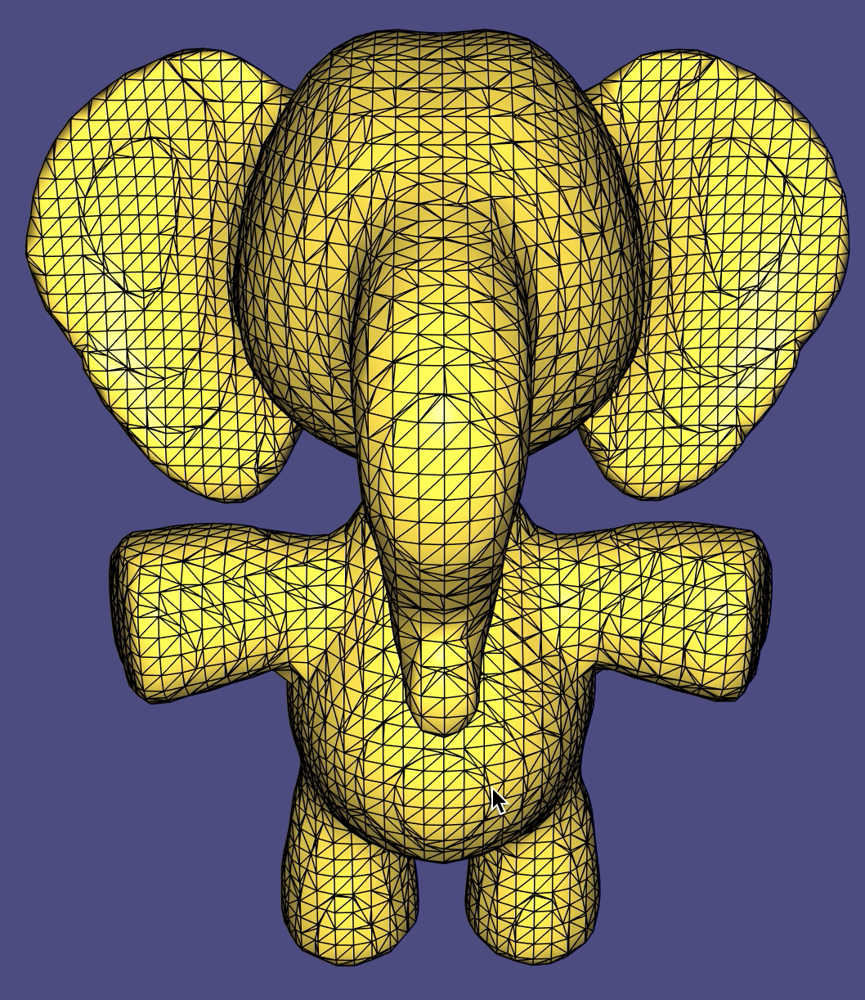
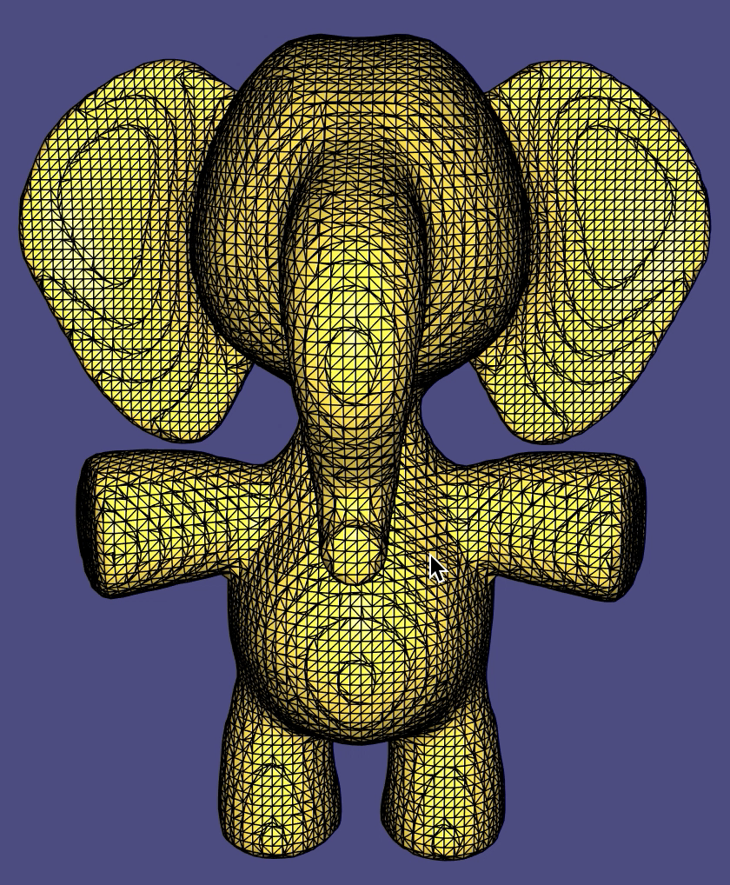

# HW10-Report

谢聪 0175

## 问题描述

- 任务: 学习曲面重建的基本算法，并实现poisson曲面重建

### poisson 曲面重建


$$
\nabla \cdot \nabla g = \nabla \cdot V
$$

​	文章的基本思路是在物体表面建立poisson方程: 指示函数的Laplace微分值等于表面法向的散度。但文章后面的分析我没看懂， 使用多重网格法结合八叉树分层求解poisson方程的操作把我劝退了，或许更重要的是后半句：投影更新残差， 但我也还是不会...。因此选用poisson重建的前身[Reconstruction of solid models from oriented point sets[Kazhdan]](https://dl.acm.org/doi/10.5555/1281920.1281931)，下称简化版poisson重建。

​	简版poisson重建相当直观，指示函数的导数等于法向场,  对输入点集所在的AABB包围盒均匀划分, 则可以构建连续微分方程的离散化形式。显然G是超定线性方程组的系数， 使用最小二乘法求解即可。 
$$
\nabla g = V \\

G g = \left[ \begin{matrix} G_x \\ G_y \\ G_z \end{matrix} \right] g = \left[ \begin{matrix} V_x \\ V_y \\ V_z \end{matrix} \right]
$$
​	确定了以上的线性方程组，则问题变成了如何计算梯度算子G和估计法向向量场。

- 梯度算子估计: 	在规则网格内部， 可以由有限差分法定义梯度算子，简单理解就是在规则网格的边上分别定义局部梯度算子。

- 法向向量场估计： 在规则网格内部，可以定义凸组合形式的三线性插值算子，即由规则法向向量场插值得到采样点的法向。而三线性稀疏插值矩阵难以求逆，虽然可以用求解线性方程组的思路求解， 但一种直观的逆向思路是将采样点的法向按插值矩阵逆向分布到规则的网格顶点上，这便是下式的后者。
  $$
  W_x V_x = N_x \\
  \rightarrow V_x = W_x^TN_x
  $$
  

#### **思考**:

​	简版poisson重建最致命的缺陷是算法负责度过高， 空间负责度和内存负责度均是三次方。使用八叉树表达三维空间的函数，若能建立相应的离散微分算子，那poisson重建的复杂度自然而然地就降了下来。

- **Octree Refinement**： 在poisson重建文章中提到了八叉树的refinement，其目标是希望能在单独的深度的所有节点上，定义凸组合形式的三线性插值算子。则相应的必要条件为，在该层节点中任一采样点的八个最近单元格都在八叉树上。这便是文章在**4.2. Vector Field Definition**中所提到的refinement的细节。 

-  按八叉树深度逐层求解，细化边缘部分: 看起来可行， 但如果是建立在简版poisson重建上， 需要额外注意八叉树的padding。在本次实验中， 我也有尝试这种做法，但无奈最后还是有BUG，没赶上DDL。最后一天才想起来直接对八叉树节点进行编码，便可以支持单元格的邻接单元格的定位、额外的八叉树的查询编辑等操作。

## 实验结果

- 网格重建

    

- 八叉树相关 poisson重建所描述的refinement已实现(或有BUG), 八叉树指定深度上的简版poisson重建的流程也已按思路实现，但最后没能跑通，也就不做讨论和展示。

- 作业框架出处说明:  这次作业其实依赖了[Alec Jacobson](https://github.com/alecjacobson) 在Github的数字集合处理的作业主页[Mesh Reconstruction](https://github.com/alecjacobson/geometry-processing-mesh-reconstruction), 作业的框架出处也是来自于此。

- **Build** 

  ```shell
  cd \path\to\SourceCode
  cd ../
  git clone --recursive http://github.com/libigl/libigl
  cd libigl && mkdir build && cd build 
  cmake ../ && make -j4
  cd ../../SourceCode
  mkdir build && cd build && cmake -ILIBIGL=../
  make ../ && make -j4
  ```

## 致谢

​	最后一次实验，不是很顺利， 但还是把自己做的一些过程和结果记录一下。非常感谢USTC的诸位师长提供这门内容充实的网上课程， 刘老师以后再开公开课， 我要是能听懂， 一定捧场。