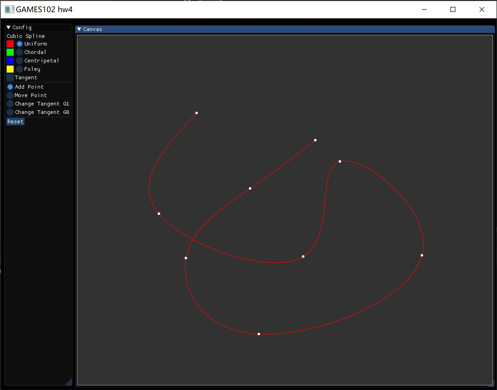
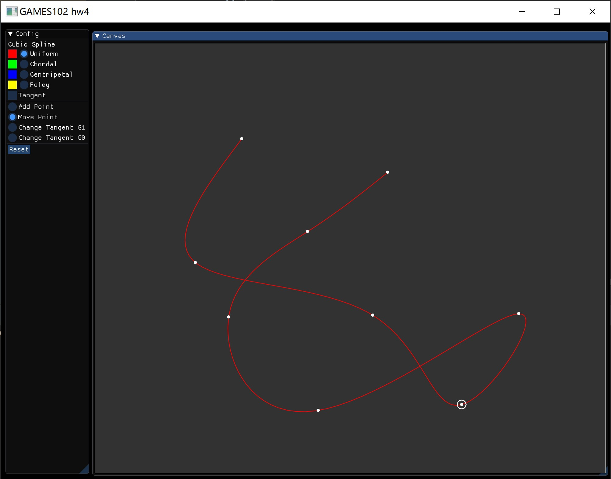
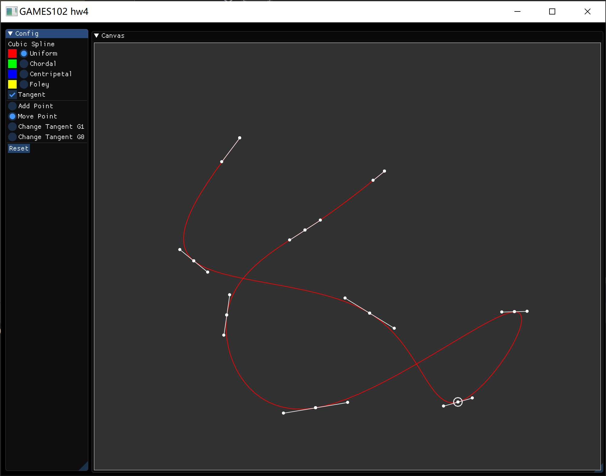
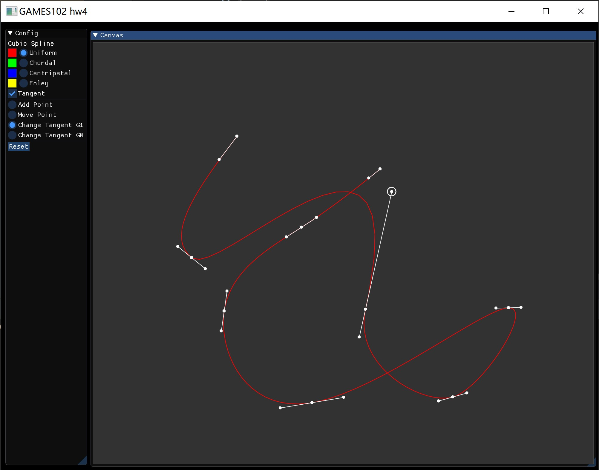
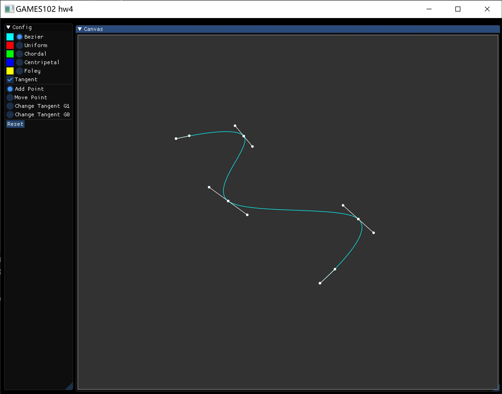
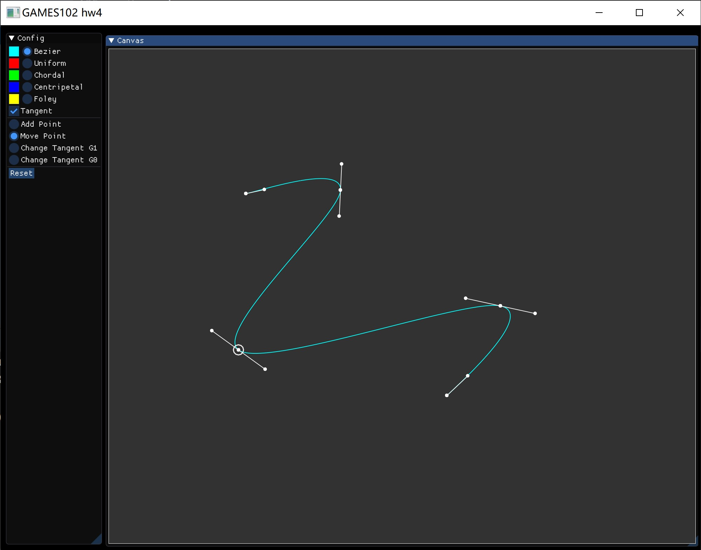
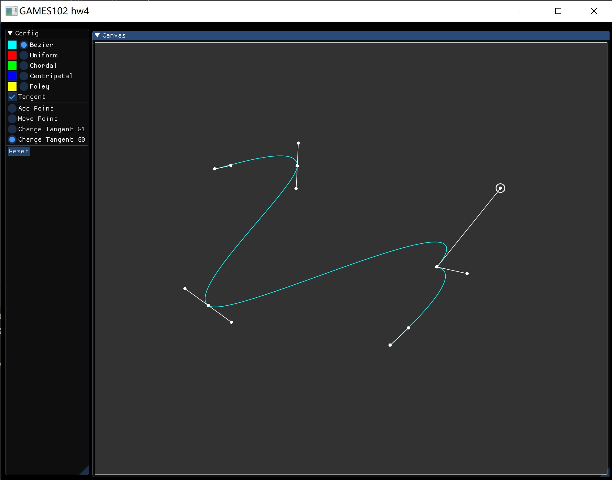
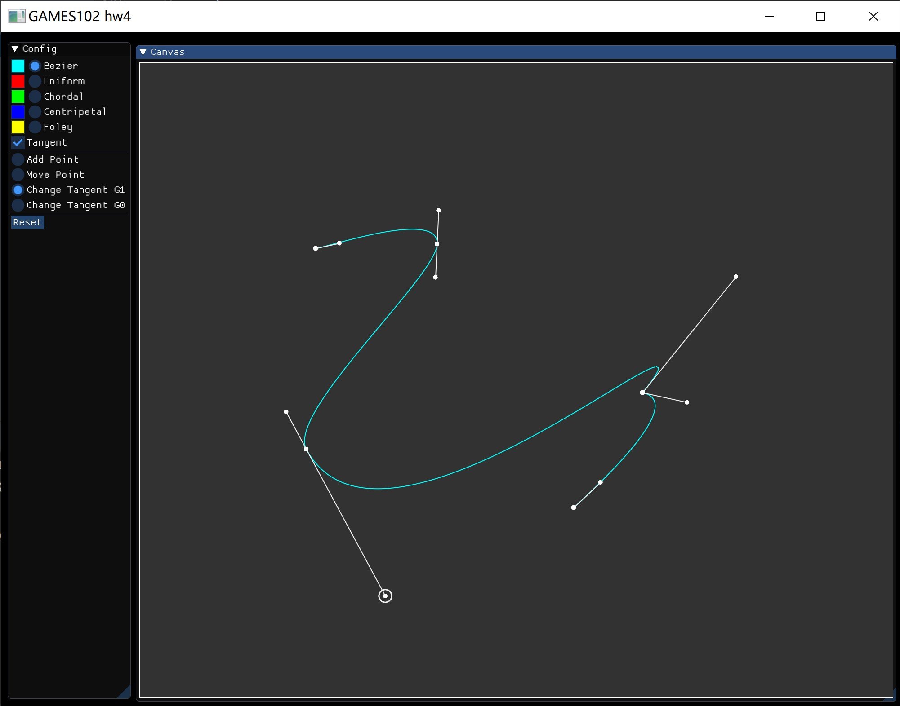

# GAMES 102 hw4

陈昱文（浙江大学 - 计算机科学与技术）

## 程序说明

### 使用说明

在右侧的大画布上，鼠标左键点击可以新增一个点，在一个点的附近点击鼠标右键可以选择该点，在“Move Point”下可以左键拖动移动。勾选“Tangent”后会显示切线，在切线点的附近点击鼠标右键可以选择该点，在“Change Tangent”下可以左键拖动修改切线。

### 使用外部库

（未使用 Utopia）

* glfw（CPM）
* Eigen（CPM）
* glad
* Dear ImGUI

## 原理

### 三次样条插值

使用 $n - 1$ 段形如 $S_i(x) = a_i + b_i(x - x_i) + c_i(x - x_i)^2 + d_i(x - x_i)^3$ 的三次函数插值 $n$ 个点，并使得最终插值结果为 $C^2$ 连续。

一共有 $4(n - 1)$ 个未知系数，有 $2(n - 1) + (n - 2) + (n - 2)$ 个约束，还存在两个自由度，即两个端点的切线或二阶导数的约束。根据约束选择的不同，被称作自然样条（二阶导为 0）、固枝样条（约定一阶导）等。

三次样条系数的求解，带入 $x_i$ 到 $S_i(x)$ 中可以直接得到 $a_i$。记 $h_i = x_{i + 1} - x_i$、$a_n = x_n$，分别考虑函数值、一阶导与二阶导，有：

* $a_{i + 1} = a_i + b_ih_i + c_ih_i^2 + d_ih_i^3$
* $b_{i + 1} = b_ih_i + 2c_ih_i + 3d_ih_i^2$
* $c_{i + 1} = c_i + 3d_ih_i$

从后两式中得 $d_i = f(c_i, c_{i + 1})$ 以及 $b_i = g(c_i, c_{i + 1})$，带入至第一个式子，可得一系列仅含 $a_i$ 与 $c_i$ 的线性等式，再加上边界约束，正好是 $n$ 个未知量与 $n$ 个等式，解该 $n$ 元线性系统得 $c_i$，并返回去解出 $b_i$ 与 $d_i$。

### 分段贝塞尔曲线

利用贝塞尔曲线的端点插值的性质，使用分段的贝塞尔曲线可以插值给定的若干个点。

具体地说，对于点 $p_i$ 到 $p_{i + 1}$ 的这一段，使用 $p_i + (p_{i + 1} - p_{i - 1}) / 6$ 和 $p_{i + 1} + (p_i - p_{i + 2}) / 6$ 作为中间的两个控制顶点，这四个控制顶点得到的三阶贝塞尔曲线作为这一段的曲线。

可以发现，以这种方式得到的曲线一定是 $G^1$ 连续的（因为一个点而从它出来的左右两个控制顶点共线）。

### 修改切线保持 $G^0$

$G^0$ 曲线即连续的曲线。

对于一段三次函数，在已知两端函数值与切线值时，可以解出该三次函数。修改曲线保持 $G^0$，即利用新的切线值求解该段三次函数。

### 修改曲线保持 $G^1$

$G^1$ 曲线是连续，且分段处两侧在分段点的切线平行。

我们在修改一侧的切线时，利用该方向修改同一点另一侧的切线为改方向的反方向（保持模长不变），然后求解两个三次函数。

## 运行结果

### 三次样条插值

创建曲线

移动顶点

显示切线

修改切线，保持 $G^1$

修改切线，保持 $G^0$

### 分段贝塞尔曲线

创建曲线

移动顶点

修改切线，保持 $G^0$

修改切线，保持 $G^1$

