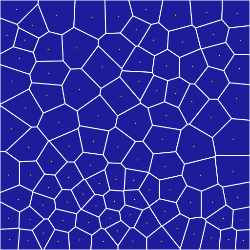
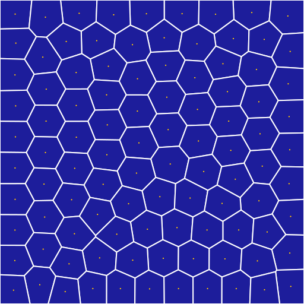
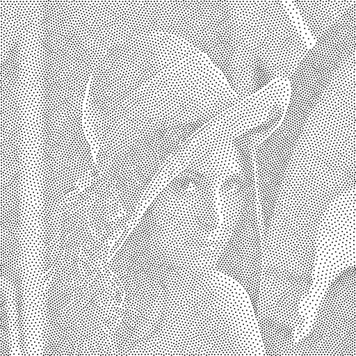
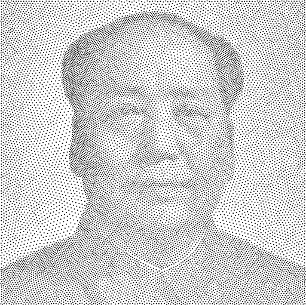
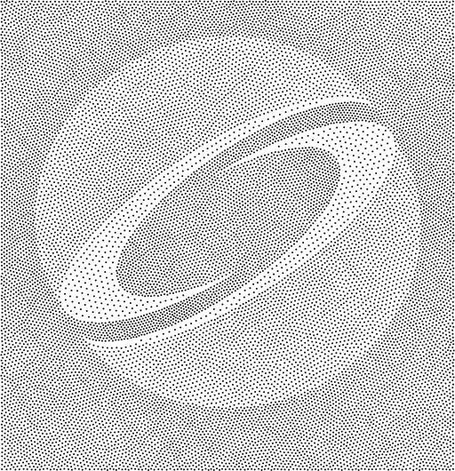
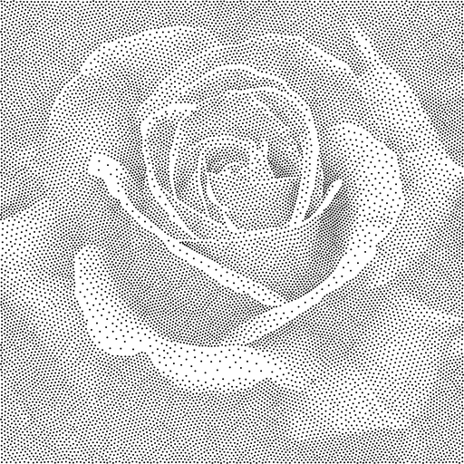
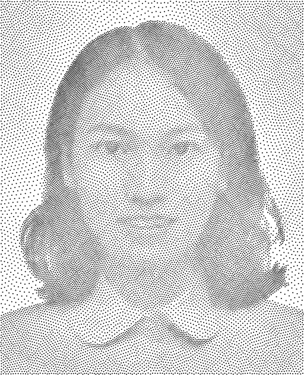
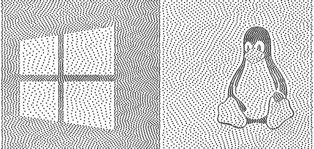

# GAMES102 HW8

## 任务 

- 实现平面点集 CVT 的 Lloyd 算法

```
1. 在给定的正方形区域内随机生成若干采样点
2. 生成这些点的 Voronoi 剖分
3. 计算每个剖分的中心，将采样点的位置更新到重心
4. 迭代步骤 2 和 3
```

## 目的 

- 学习 Voronoi 算法、使用相关数学库（如 [Triangle](http://www.cs.cmu.edu/~quake/triangle.html)、[CGAL](https://www.cgal.org/) 等）

- 思考: 如何在曲面上采样并生成 CVT（如何将算法推广到流形曲面）？


## 实验方法 

### 平面点集 CVT 的 Lloyd 算法

- 利用第三方库[JCash/voronoi](github.com/JCash/voronoi)构建**voronoi diagram**, 并计算每一个胞体( **Cell** )的重心( **barycenter** ):
  $$
  C_i = \frac{\int_Ax\rho(x)dA}{\int_A\rho(x)dA}
  $$
  voronoi diagram的胞元(**Cell**)一定是凸多边形(**Convex Polygon**), 且经典场景里$\rho(x)\equiv0$, 或称等密度.。记凸多边形胞体为点序列$\{P_1, P_2, ..., P_n\}$, 那么此时的重心为:
  $$
C_i = \frac{\sum_{i=0}^{n-1}det(v_i, v_{i+1})\cdot(v_i+v_{i+1})}{3\sum_{i=0}^{n-1}det(v_i, v_{i+1})}
  $$
  这里的凸多边形重心的求解思路是, 通过三角化将凸多边形分解成质点固定的三角形之间的质点之间的新质点问题, 其中三角形的质点重心坐标为: ($\frac{1}{3}, \frac{1}{3}, \frac{1}{3}$).  
  
  
  
- **变密度CVT**(varying density): 变密度的cvt的提出在理论上的推广是很直观的, 在应用层面上主要是CVT推广到流形曲面的强力需求和stippling的一类应用。 
  
  - 其中CVT推广到流形曲面的主要思路是, 由于基于测地距离度量的voronoi diagram难以实现, 于是开始考虑将曲面参数化到平面上并在平面上构造相应的voronoi diagram。 但是在cvt推广到流形曲面的年间, 并没有畸变非常小的参数化方法。于是变密度的CVT方法便应运而生, 参数化的网格上可以定义平面上的逐顶点密度函数: $\rho(v_i) = \frac{Area(v_i^{3D})}{Area(v_i^{2D})}$, 那么通过网格的线性插值可以得到密度标量场。
  - 对于stippling类的场景往往是将一个灰度图像视作密度函数。
  
  可以发现以上的两类场景的共同核心部分都是**变密度CVT**的实现，具体包括**密度采样器**和**变密度胞体的重心计算**。
### 相关实现 

- 利用第三方库[JCash/voronoi](github.com/JCash/voronoi)构建**voronoi diagram**, 并将相应的结果输出到svg矢量图像, 后续可以继续使用ffmpeg将图序列转换成视频。
- 变密度胞体的重心计算原理便是本节给出的第一个公式， 编码层面只需要参考光栅化的思想对胞体进行采样，但需要保证采样的对称性和稳定性。
- 本次实验将关注于变密度CVT的stippling类的应用。

## 运行结果 

- Lloyd算法是经典的局部迭代法, 在理论上无法保证单次迭代收敛, 但总体上算法收敛速度还算可接受. 单次迭代的主要计算是构建voronoi diagram, 其算法复杂度为$O(nlogn)$.  下图左图为初始点集的voronoi diagram和胞体的重心(红点), 右图为20次迭代的结果. 编码所允许的精度收敛界为$1e-3$.



- 变密度CVT效果图
  

    


- 具体迭代过程可视化参考演示视频 

